大家好，我是阿晨君。这是我的第一篇较长的技术文章。我将结合我近一年的使用经验来带大家了解DeepSeek API这个容易让小白用户摸不着头脑的东西。

# 1、API是什么？

API在常见的专业解释术语是：

[“应用编程接口（application programming interface，API），定义了在计算机之间或在计算机程序之间的连接，它是一种类型的软件接口，用来向软件的其他部分提供服务。”](https://zh.wikipedia.org/wiki/%E5%BA%94%E7%94%A8%E7%A8%8B%E5%BA%8F%E6%8E%A5%E5%8F%A3)

这句话让人很迷茫啊，但用一句话解释用途就是：

“让你在DeepSeek官方平台外使用（调用）DeepSeek的官方模型”

什么意思呢？我们都知道我们使用能从软件/客户端上使用DeepSeek的原理是：

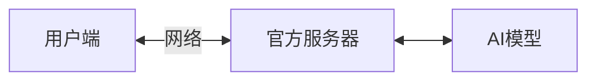

但这一切的前提是：“你需要在**DeepSeek官方平台上才能使用**”

所以我们需要的是：“在DeepSeek官方平台外使用”，所以我们需要**用API这个接口来让DeepSeek的模型直接给我们提供服务**

那么我们就可以在其他的软件来使用它了，**想要使用直接把请求的数据发到云端然后再把结果传回来就行了**

至于可以干什么取决于你使用的软件支持什么，目前绝大多数的软件都支持三个内容：

- 本地知识库
- 自定义参数
- [MCP](https://zh.wikipedia.org/wiki/%E6%A8%A1%E5%9E%8B%E4%B8%8A%E4%B8%8B%E6%96%87%E5%8D%8F%E8%AE%AE)

而且由于返回的数据不经过官方对话平台，所以一般情况下是没有撤回机制的。比如官方平台输出完后突然撤回变成“这个话题暂时无法回答”的这种操作在API直接调用的情况下几乎是没有的，但模型如果内嵌了一个机制那在默认系统提示词下还是会回避一些问题。不过大部分可以通过修改系统提示词（System Prompt）来进行破甲解决。目前我个人的测试经验就是这样，破甲之后就基本没有限制了。

当然本篇文章主要讲述如何获取并进行简单的使用方法演示，不会涉及得那么深奥，接下来开始实操。

# 2、登录

打开DeepSeek官网，点击前往[API开放平台](https://platform.deepseek.com)，随后进行登录，推荐谷歌登录（任意中国大陆外IP访问页面）因为可以无需实名并支持更多付款方式

# 3、认识主页

进入主页后我们需要注意几个页面：

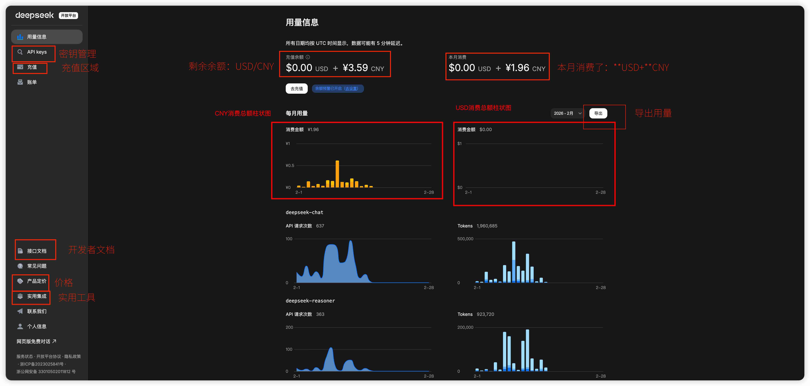

- 用量信息：显示当月用量信息
- 充值：充值区域
- API Keys：管理密钥
- 账单

- 侧边栏中的：

  - 接口文档：开发者文档

    - [产品定价](https://api-docs.deepseek.com/zh-cn/quick_start/pricing/)

  - [实用集成](https://github.com/deepseek-ai/awesome-deepseek-integration/blob/main/README_cn.md)：实用软件和工具，建议没事翻翻

# 4、价格

DeepSeek API的调用价格以Token计数,具体在接口文档中的[模型&价格](https://api-docs.deepseek.com/zh-cn/quick_start/pricing)，具体Token的用量计算在[Token的用量计算](https://api-docs.deepseek.com/zh-cn/quick_start/token_usage)这一页，建议都看看

注：同一个目录下还有[其他的文档](https://api-docs.deepseek.com/zh-cn/)也可以看看，都很不错适合入门了解

# 5、获取密钥

点击**充值**，会弹出以下页面，上方可选择充值美元

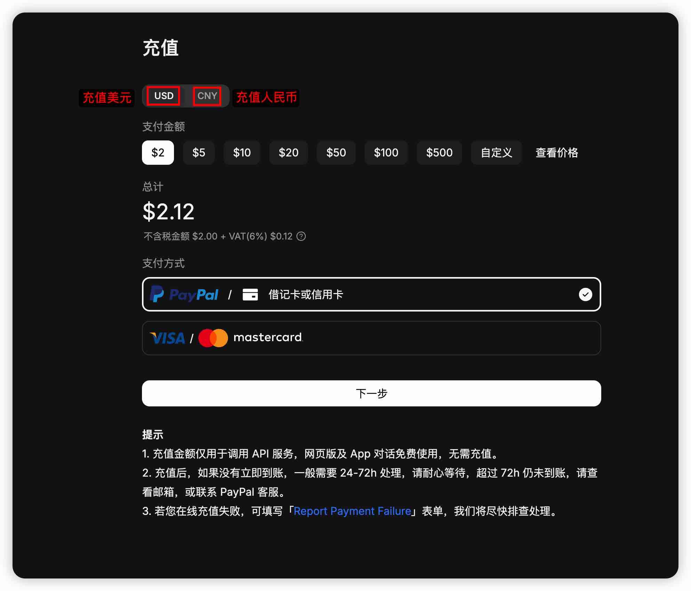

也可以选择充值人民币

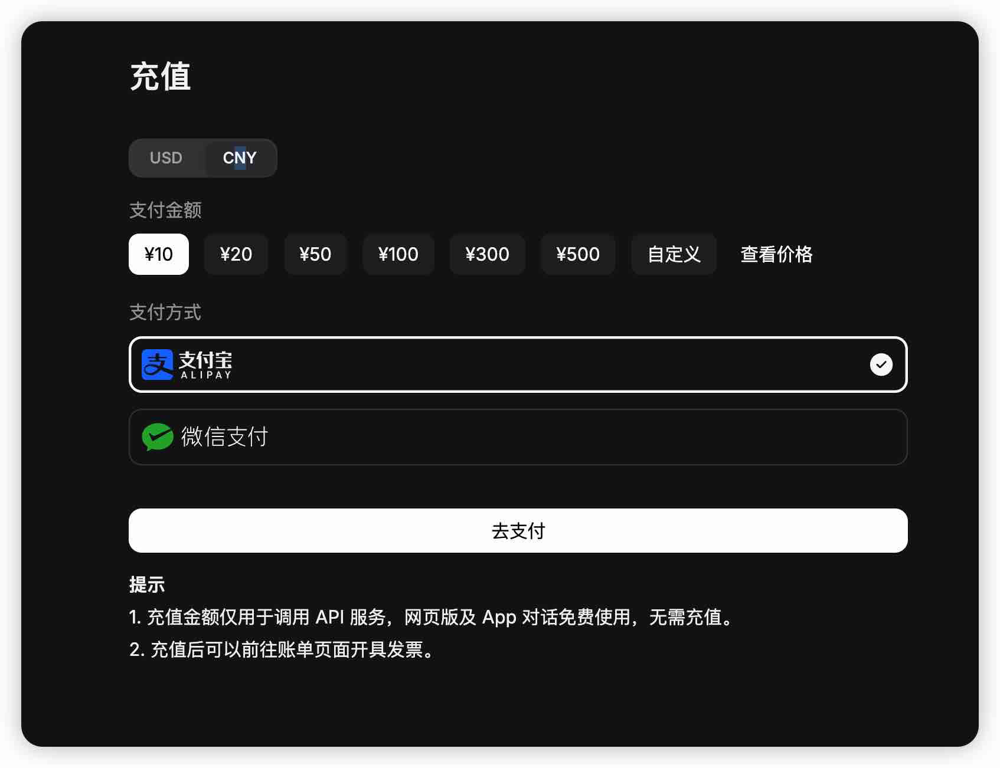

选择好充值方式后，点击**去支付**即可跳转至支付页面

支付完成后前往**API Keys**，**创建一个API Keys**。填写一个名字，可以是使用人也可以是用途或软件

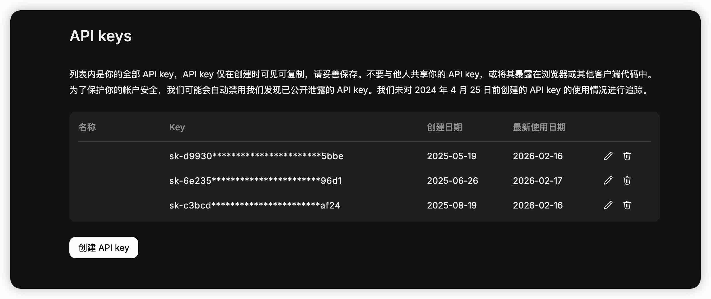

随后会给你一串API密钥，注意不要把它弄丢了，否则需要重新创建一个

**当然弄丢了只是小问题，千万不要把它泄漏出去了，不然有可能会造成财产损失（你的token要和你说拜拜了）。总之一定要保护好，不要交给任何你不信任的人。**

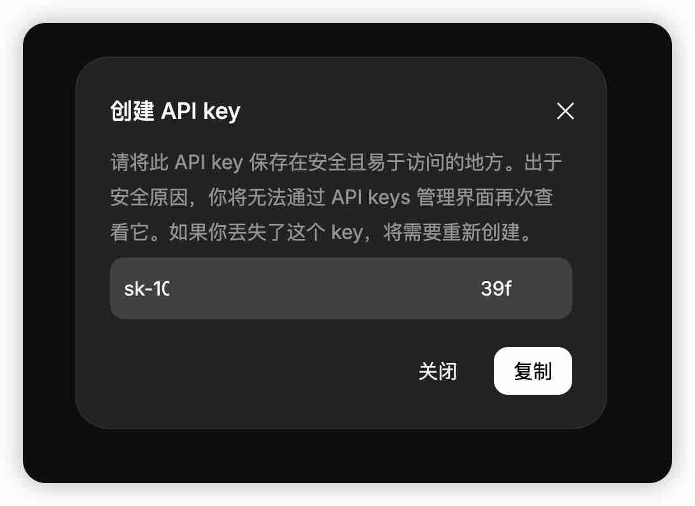

# 6、接入方法示例

这时候我们就可以把它接入到一个软件里头了，也可以选择前往**[实用集成](https://github.com/deepseek-ai/awesome-deepseek-integration/blob/main/README_cn.md)**里找一个软件来使用，以下我将演示我自己用的软件都怎么设置接入DeepSeek的

## 6.1、接入Chatbox

首先我先演示我使用了将近一年的工具**[Chatbox](https://chatboxai.app/zh/)**的接入方法，正如他们的官网所说，Chatbox是一款强大的AI客户端，支持众多先进的AI模型和API，可在 Windows、MacOS、Android、iOS、Linux 和网页版上使用。对于我来说，他是我第一个接触的软件也是目前唯一一个每天我都在使用的AI聊天软件，正如软件的名字：Chatbox  
并且他们也提供了自家的AI服务，想同时体验的可以去试一下，不过截止写这篇文章前我还没有试过

我使用网页版进行演示，网页版和本地版不能说是毫无差别，至少可以说是一模一样

**主页展示：**

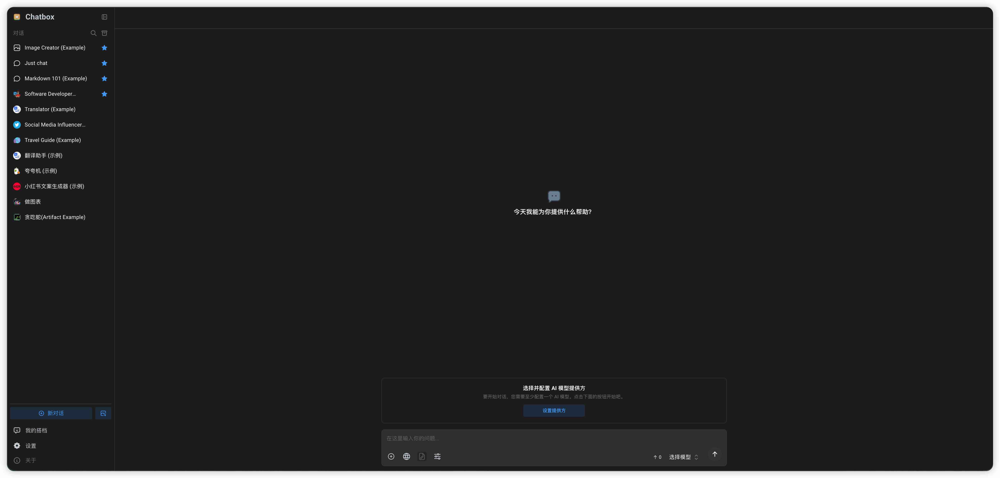

### 设置语言

不管你是下载或者使用网页，首先要将语言设置为简体中文，如果系统自己已经切换到中文了可以跳过这一步

1. 首先点击Settings
2. 找到General Settings
3. 将Display Settings下的Language选项更换为简体中文

随后进行设置：

### 接入DeepSeek

在设置中找到模型提供方，点击侧边栏的DeepSeek，将刚获得的API密钥填入进去，点击检查，任意选择一个模型，显示连接成功即可

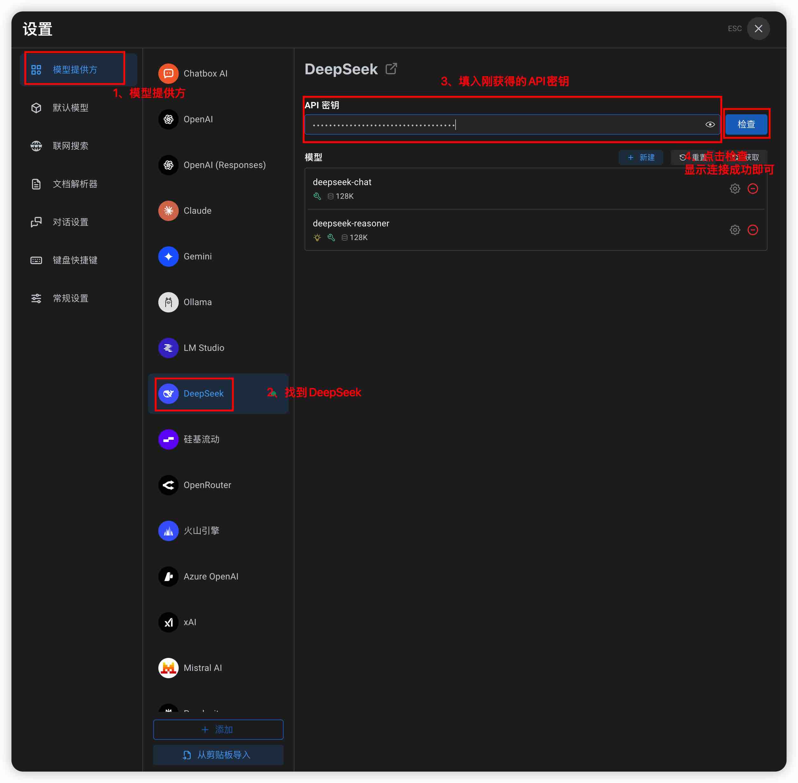

## 6.2、接入Cherry Studio

Cherry Studio同样是我使用了近一年的软件，它可以作为电脑端随时随地都可以使用它来完成任何工作，他非常适合用来办公使用，并且集成了非常多的很多功能

- 翻译
- 助手
- 知识库
- 笔记
- 以及数据设置中的导入导出、数据备份和导入第三方应用，让我惊艳的是它可以将AI的内容导入进一些知名的笔记软件，比如notion、思源、obsidian、语雀以及Joplin

**主页展示：**

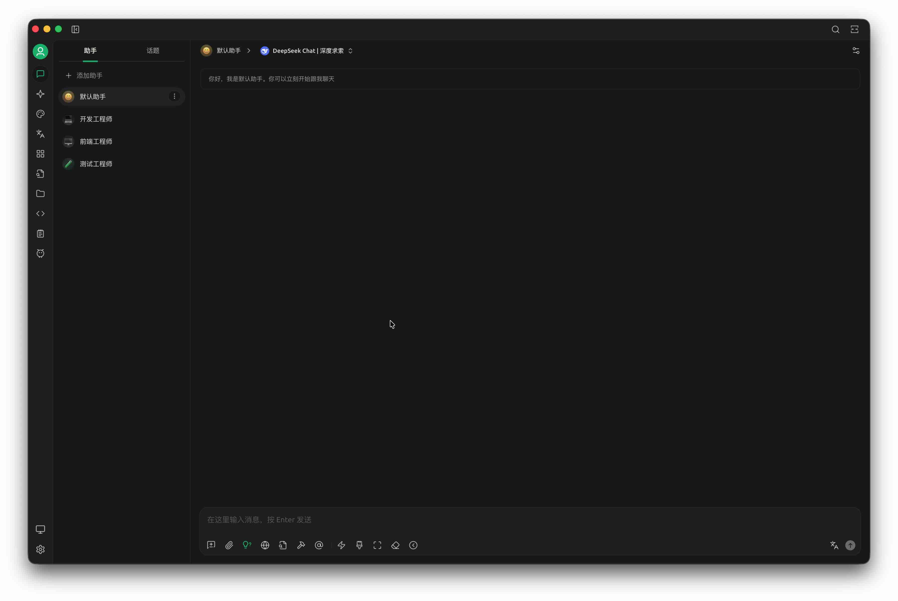

**数据设置界面（这个一定要看真的NB）**

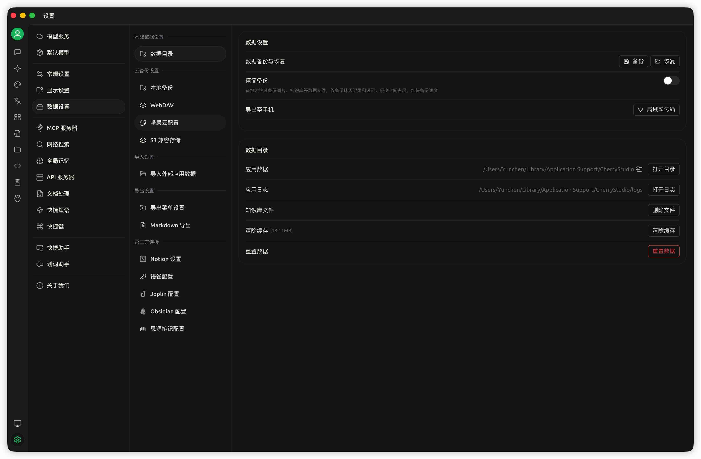

### 接入DeepSeek

> 通常情况下，他默认就是简体中文界面，只要简体中文是你的系统语言

首先打开设置，找到模型服务，在侧边栏中找到“深度求索”，填入密钥后点击测试即可完成

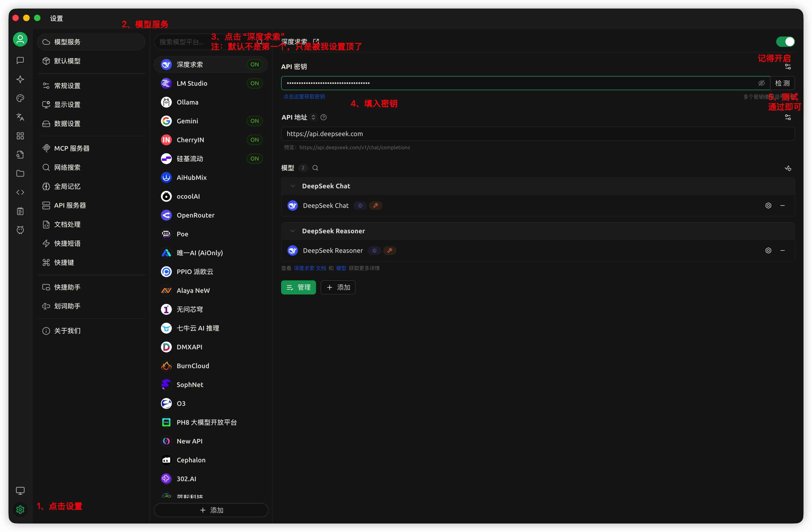

# 7、其他软件接入

不管使用什么软件，即使没有在界面上写着支持DeepSeek，但它不一定不能支持接入DeepSeek，只要允许自定义设置API地址、密钥以及模型并兼容的是支持OpenAI协议的URL一般都可以支持。

你会注意到每个支持DeepSeek的软件都会有一项**API地址**，这个就像网站的域名一样，API Keys可以理解为验证信息。所以当你所使用的软件没有写支持DeepSeek的时候，可以在**API地址或URL**中设置为**https://api.deepseek.com**，将类型设置为OpenAI，认证方式选择**密钥**，填入你的密钥即可，**当然真实情况请以官方文档为主。**

---

那么以上就是我所要分享的内容了，更多内容可前往官方API文档了解，祝大家玩的开心，用的开心

本篇文章引用：

- 维基百科：[应用程序接口](https://zh.wikipedia.org/wiki/%E5%BA%94%E7%94%A8%E7%A8%8B%E5%BA%8F%E6%8E%A5%E5%8F%A3)
- 维基百科：[模型上下文协议](https://zh.wikipedia.org/wiki/%E6%A8%A1%E5%9E%8B%E4%B8%8A%E4%B8%8B%E6%96%87%E5%8D%8F%E8%AE%AE)

本篇文章软件版本：

- Chatbox网页版：[v1.19.0](https://chatboxai.app/zh/help-center/changelog)
- Cherry Studio：[v1.7.19](https://github.com/CherryHQ/cherry-studio/releases/tag/v1.7.19)
